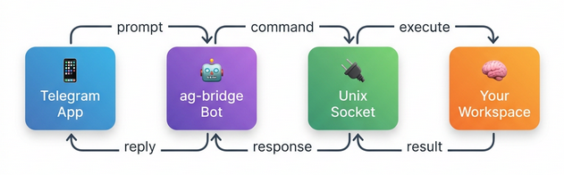

# 🤖 ag-bridge

> Control [Antigravity](https://blog.google/technology/google-deepmind/) remotely via Telegram.

**ag-bridge** is a lightweight Telegram bot that bridges your phone to an Antigravity AI coding session running on your Mac. Send any prompt from Telegram and get results back — like having your AI pair programmer in your pocket.

## How It Works



1. You send a message to your Telegram bot from your phone
2. The bot forwards it through a Unix domain socket to a watching Antigravity session
3. Antigravity executes the prompt with full tool access (files, terminal, etc.)
4. The result summary is sent back to you on Telegram

## Prerequisites

- **macOS** with Python 3.9+
- **Antigravity** running in your IDE (VS Code / Cursor)
- **Telegram account** + a bot created via [@BotFather](https://t.me/BotFather)
- A workspace with Antigravity configured (run `ag-bridge init` to add the skill)

## Installation

### 1. Clone this repo

```bash
git clone https://github.com/thienhm/ag-bridge.git ~/.ag-bridge
```

### 2. Install dependencies

```bash
pip3 install -r ~/.ag-bridge/requirements.txt
```

### 3. Add `ag-bridge` to your PATH

Add this to your `~/.zshrc`:

```bash
export PATH="$HOME/.ag-bridge:$PATH"
```

### 4. Set up your bot

Run the guided setup:

```bash
ag-bridge onboard
```

This will walk you through creating a Telegram bot and saving your `config.json`.

> **Already configured?** Use `ag-bridge configure` to update your bot token or chat ID.

### 5. Add the skill to your workspace

Navigate to your project and run:

```bash
cd /path/to/your/workspace
ag-bridge init
```

This copies the `bridge-watcher` skill into `.agent/skills/bridge-watcher/`.

## Usage

### 1. Start the bot

In a **separate terminal**, start the bridge bot:

```bash
ag-bridge start
```

Keep this terminal open — the bot runs in the foreground.

### 2. Connect Antigravity

Open a **dedicated Antigravity workspace** in your IDE and say:

> Start the bridge for remote work

or simply:

> Start ag-bridge

Antigravity will connect to the bot and you'll receive a Telegram notification:

> 🟢 **Antigravity session active**
> Workspace: `your-project`
> Ready to receive commands.

> **Why start the bot separately?** Running the bot outside of Antigravity keeps the AI session lean — it doesn't waste context tokens on bot process management, which means longer bridge sessions before context exhaustion.

### Send commands

Just message your bot on Telegram like you would in the IDE:

- "Run the tests"
- "What files changed today?"
- "Fix the lint errors in utils.py"
- "Create a new feature branch for login"

### Disconnect

To stop the bridge, either say in Antigravity:

> Stop ag-bridge

> Stop the bridge

> Disconnect the bridge

Or send `/stop` from Telegram. Antigravity will gracefully shut down the bridge client and bot processes.

### Bot commands

| Command   | Description                               |
| --------- | ----------------------------------------- |
| `/status` | Check if an Antigravity session is active |
| `/stop`   | Disconnect the bridge session             |
| `/help`   | Show available commands                   |

## Architecture

| Component         | Location                                                            | Purpose                            |
| ----------------- | ------------------------------------------------------------------- | ---------------------------------- |
| **Bot**           | `~/.ag-bridge/bot.py`                                               | Telegram bot + Unix socket server  |
| **Bridge Client** | `<workspace>/.agent/skills/bridge-watcher/scripts/bridge_client.py` | Socket ↔ stdio translator          |
| **Watcher Skill** | `<workspace>/.agent/skills/bridge-watcher/SKILL.md`                 | Instructs Antigravity how to watch |

## Limitations

- **One command at a time** — commands are processed sequentially
- **Requires active session** — Antigravity must be watching in a dedicated IDE tab
- **Text responses only** — no file attachments (v1)
- **Same Mac** — bot and Antigravity must be on the same machine
- **10 min timeout** — long-running tasks will time out

## Security

- Only messages from `allowed_chat_ids` are processed
- Bot token and chat IDs are stored in `config.json` (gitignored)
- Communication uses Unix domain sockets (local only, no network exposure)

## License

MIT
